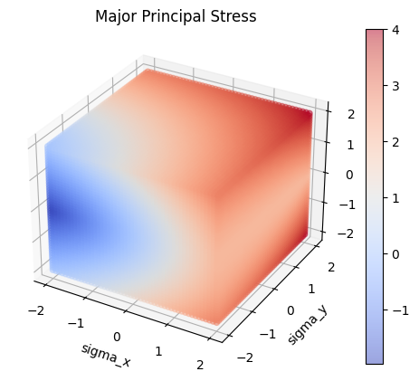
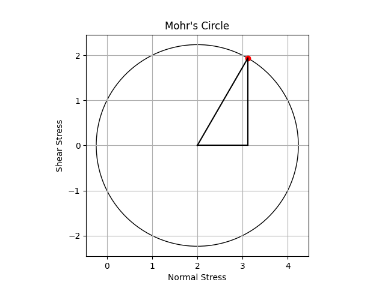

# mods

Functions that implement equations from "Mechanics of Materials" by R.C. Hibbeler.



## Installation

The following does not yet work as this package is not yet on PyPI.

```bash
$ pip install mods
```

For now, perform the following steps:

1. Clone the repo
2. `cd` into the cloned repository and do:

```bash
$ poetry install
```

You need to ensure that you have `poetry` installed and accessible from your command line. Ideally, you should be
working in a `conda` environment.

## Documentation

You can find the documentation [here](https://mechanics-of-deformable-solids.readthedocs.io/).

## Usage

You can plot Mohr's circle by providing `sigma_x`, `sigma_y`, `tau_xy` and a plane inclination angle `theta` (in degrees):

```python
from mods.stress_transformation import mohrs_circle_plane_angle_plot

sigma_x = 1
sigma_y = 3
tau_xy = 2
theta = 30

mohrs_circle_plane_angle_plot(sigma_x, sigma_x, tau_xy, theta)
```



See the [documentation](https://mechanics-of-deformable-solids.readthedocs.io/) for more details.

## About the name
"mods" stands for "mechanics of deformable solids", which is the course title for ME 219 and ME 220
at the University of Waterloo's department of mechanical and mechatronics engineering. "Mechanics of Materials"
by Hibbeler is the textbook used in these two courses.

## Contributing

Interested in contributing? Check out the contributing guidelines. Please note that this project is released with a Code of Conduct. By contributing to this project, you agree to abide by its terms.

## License

`mods` was created by John You. It is licensed under the terms of the MIT license.

## Credits

`mods` was created with [`cookiecutter`](https://cookiecutter.readthedocs.io/en/latest/) and the `py-pkgs-cookiecutter` [template](https://github.com/py-pkgs/py-pkgs-cookiecutter).
