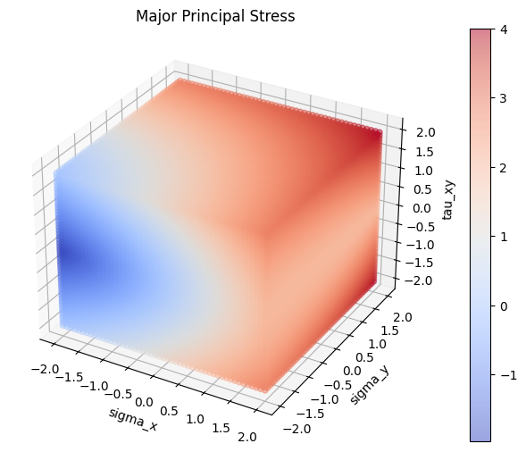

# mods

Functions that implement equations from "Mechanics of Materials" by R.C. Hibbeler.



## Installation

```bash
$ pip install mods
```

## Usage

- To do

## About the name
"mods" stands for "mechanics of deformable solids", which is the course title for ME 219 and ME 220
at the University of Waterloo's department of mechanical and mechatronics engineering. "Mechanics of Materials"
by Hibbeler is the textbook used in these two courses.

## Contributing

Interested in contributing? Check out the contributing guidelines. Please note that this project is released with a Code of Conduct. By contributing to this project, you agree to abide by its terms.

## License

`mods` was created by John You. It is licensed under the terms of the MIT license.

## Credits

`mods` was created with [`cookiecutter`](https://cookiecutter.readthedocs.io/en/latest/) and the `py-pkgs-cookiecutter` [template](https://github.com/py-pkgs/py-pkgs-cookiecutter).
